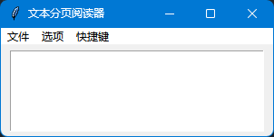
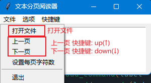
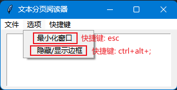

## Fishing tools
上班摸鱼🐟小app, 闲来无事两个小时搓了一个, 感兴趣可以看看

### 效果预览
1. 窗口 <br>

2. 文件 <br>

3. 选项 <br>

4. 隐藏边框 <br>


---
### 下载
[发行版地址](https://gitee.com/MeverikC/fishing-tools/releases/tag/v1.0-master) <br>
> 因为 `.exe` 没有签名, 所有可能会被识别成病毒或有威胁的文件, 若无法下载可以克隆项目直接运行源码
> ```bash
> git clone https://gitee.com/MeverikC/fishing-tools.git
> cd Fishing tools
> python app.py
> ```

---

### 使用
双击运行 `app.exe`
> 1. 暂不支持自定义快捷键
> 2. 因隐藏边框后无法使用windows的矿口管理, 所以请先调整好大小后再使用 `ctrl+alt+;` 隐藏边框及菜单
> 3. 快捷键: 
>    * 上一页: `up` || ↑
>    * 下一页: `down` || ↓
>    * 隐藏/显示边框及菜单: `ctrl+alt+;`
>    * 最小化窗口: `esc`
